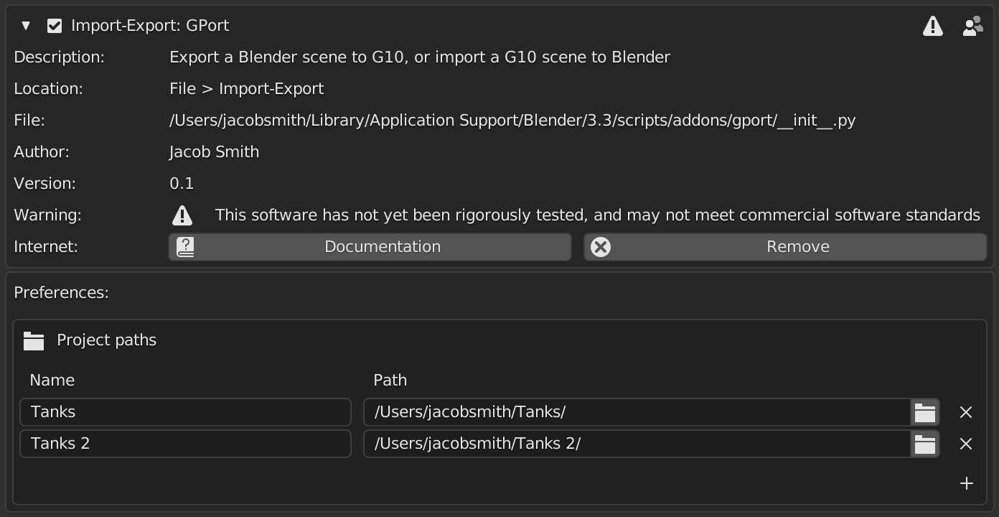

# GPort
 GPort is an Import-Export Addon for Blender, and a tool for the G10 Engine. 

## Background
 Game engines are used for making games, and games need assets. Thus, game engines need a way to manage assets. Creating assets is usually the responsibility of the artist, thus the artist needs a way to create their assets. Assets are well defined in G10 (see [G10 Schema](https://github.com/Jacob-C-Smith/G10-Schema)), however manual asset creation is tedious, error prone, difficult to optimize, and for most people, utterly unacceptable. Thus, an automated software solution for creating game assets is required. Said software solution is GPort. 

## Using GPort
   
   ### Installing GPort
   To install GPort, navigate to the [GPort release page](https://github.com/Jacob-C-Smith/GPort/releases), and download the latest release. Take note of where you save the zip file. When your download is complete, open Blender and navigate to ```Edit > Preferences > Addons```, and click on "Install". Navigate to the GPort zip you just downloaded, and install the addon. Make certain to check the box, so the addon is enabled. If you've done everything correctly, the Blender Preferences panel should look like this.

   

   ### Creating a GPort project

   GPort stores your assets in a project directory. To use GPort, you must first configure a project directory. This should be an empty directory somewhere on your filesystem. Configure your project in the addon preferences panel. You can configure as many as you'd like, using the ```➕``` and ```❌``` buttons to add and remove projects.

   

   ### Exporting a scene

   To export a scene, navigate to File > Export > G10 Scene (.json)

   ### Importing a scene

   TODO: DOCUMENT


## Design choices
 As previously established, it is often the artists job to create assets. Most artists do their work in a 3D software, such as Blender, Autodesk Maya, or 3ds Max. I decided to write GPort for Blender. 
 
 ### Why Blender?
 I chose Blender over other softwares because Blender is free, and I don't have the money nor the income to purchase any Autodesk product. Even if this financial restraint did not apply, there are still good reasons to use Blender. I've enumerated them below

      1. Blender is open source. (Anyone can use Blender) 
      2. Blender is very popular.
      3. Blender has a powerful raytracer, which can be repurposed for precomputing light
      4. Blender has a well documented Python API
      5. I have many years of experiance with Blender